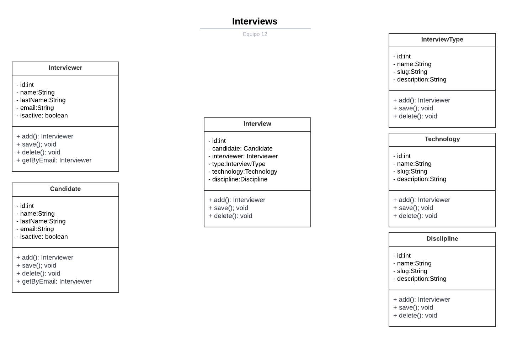

# Postwork 2

### 🎯 OBJETIVOS

- Pasen de modelos de datos abstractos (representaciones gráficas) a implementaciones concretas (clases).
- Apliquen conceptos de reutilización de código.
- Incluyan pruebas unitarias adicionales para probar su funcionalidad.
- Apliquen técnicas de diseño de pruebas.
- Exploren la herramienta JUNIT.

### 🚀 DESARROLLO

Siguiendo con el desarrollo de nuestro software, ahora añadiremos los modelos (clases) definidos en el Reto 2.

Adicionalmente tenemos que crear pruebas que validen el correcto funcionamiento de nuestro software.

El project manager ha definido como objetivo para este sprint añadir las siguientes características a nuestro sistema actual:

- Crear las clases correspondientes a los siguientes modelos:
    - Modelo Interview
    - Modelo Candidate
    - Modelo Interview Type
    - Modelo Technology
    - Modelo Discipline

La definición de hecho (Definition of Done) establece que todo el código generado debe contar con las pruebas unitarias necesarias para validar su correcto funcionamiento.

Sigan las instrucciones, dividan las actividades de forma equitativa entre cada miembro del equipo y recuerden que dentro de su paquete principal se deben crear las siguientes clases:

1. Crear la clase correspondiente al modelo Candidate.

2. Crear la clase correspondiente al modelo Interview Type.

3. Crear la clase correspondiente al modelo Interview.

4. Crear la clase correspondiente al modelo Technology.

5. Crear la clase correspondiente al modelo Discipline.

6. Añadir las pruebas que consideres necesarias.

7. Los casos de prueba contemplados, se deben incorporar en el documento de casos con toda su información completa.

### Indicaciones generales

Una vez que hayan terminado el postwork respondan las siguientes preguntas:

¿Emplearon herencia en alguna clase?

**No, en este punto de avance**
_________________________________________________________________________________________________________________________________________________________________________________________________________________________________

¿Qué tipo de datos son tus identificadores (id)? ¿Por qué elegieron ese tipo de dato?

**Es tipo int, se pueden almacenar 2,147 millones de registros aproximadamente, de acuerdo con la naturaleza de la información parece ser una cantidad suficiente.**
_________________________________________________________________________________________________________________________________________________________________________________________________________________________________

¿Decidieron añadir pruebas? ¿Por qué?

**Si, para asegurar la calidad, confiabilidad y el correcto funcionamiento del sistema.**
_________________________________________________________________________________________________________________________________________________________________________________________________________________________________

