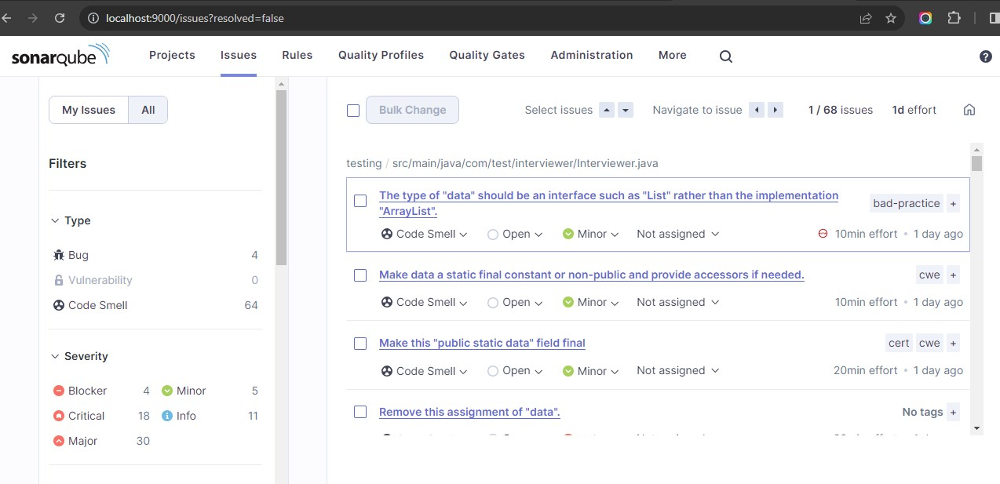
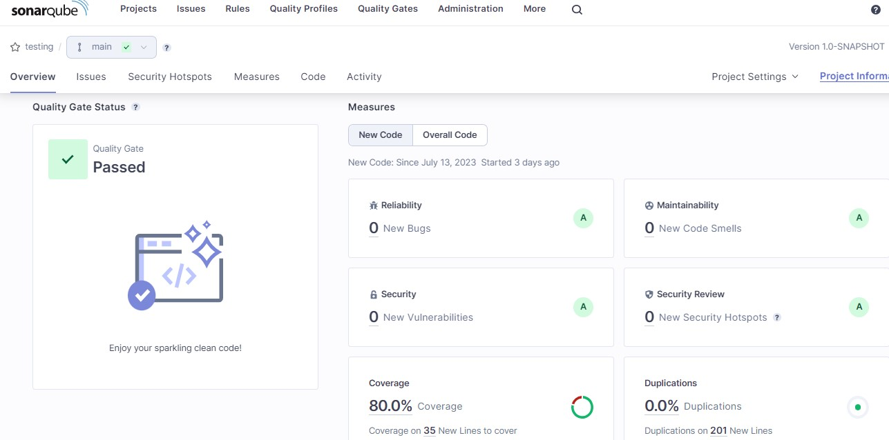
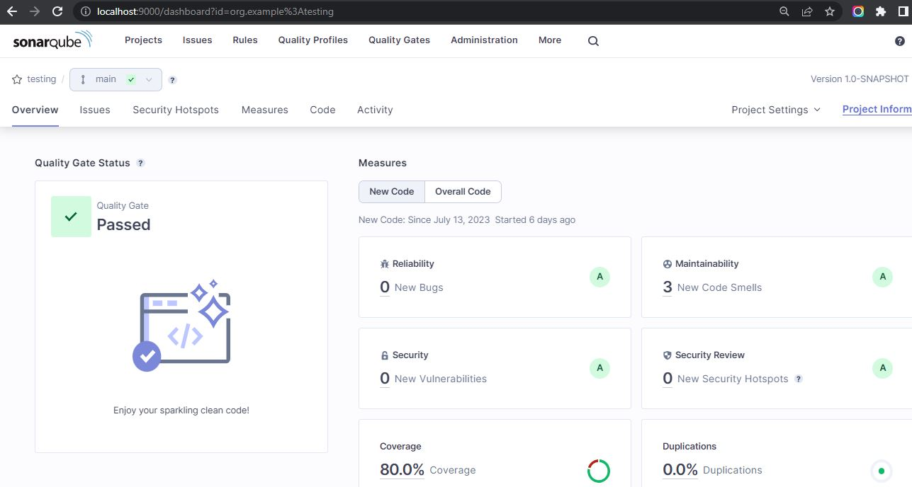
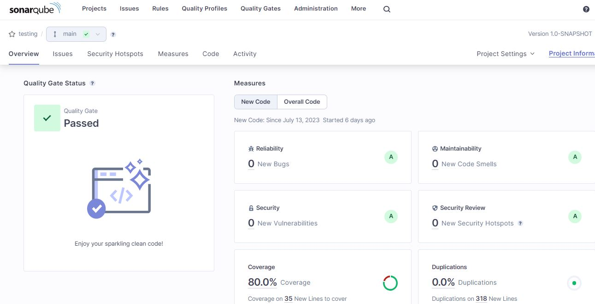

# Postwork 8

## 🎯 OBJETIVOS

- Desarrollar interfaz gráfica para añadir entrevistadores.
- Conectar interfaz graficación nuestra API
- Ejecutar un análisis con SonarQube

## 🚀 DESARROLLO

En este postwork continuaremos con el desarrollo de nuestro sistema de entrevistadores. La tarea a realizar es realizar
una interfaz gráfica (en Vue.js, React, Angular, Vanilla JS, etc.)  que se conecte con nuestro endpoint que nos permite
añadir un entrevistador.

Adicionalmente tendrás que ejecutar un análisis estático a tu código con SonarQube

### Sigue estas instrucciones

1. Crea un nuevo proyecto utilizando tu framework de preferencia. [REPOSITORIO](https://github.com/UnCarro/Bedu-PW8-Frontend)

2. Crea un formulario que se conecte con la API existente y permita añadir nuevos entrevistadores.

3. Añadir las pruebas necesarias

4. Ejecutar un análisis de SonarQube a nuestro código.

5. Desplegar esta aplicación y la API a Heroku.

### Indicaciones generales

Una vez que hayas terminado la actividad responde las siguientes preguntas:

¿En qué lenguaje se desarrolla SonarQube?

Java

___
¿Cuáles son los requisitos para instalar SonarQube?

**Sistema Operativo**: es compatible con varios sistemas operativos, entre ellos: Windows, Linux y macOS.

**Java**: se debe tener instalado el entorno de ejecución de Java (JRE) o el de desarrollo  (JDK). SonarQube 10.x requiere Java 11+ o 17+ para el servidor.

**Base de Datos**: necesita una base de datos relacional para almacenar los datos. Las bases de datos compatibles incluyen PostgreSQL, MySQL, Oracle y Microsoft SQL Server. Debe estar configurada y accesible para SonarQube.

**Recursos de Servidor**: suficiente CPU, memoria y espacio en disco que varían de acuerdo a cada proyecto.

**Navegador Web**: se requiere un navegador web como Chrome, Firefox o Edge para consultar los reportes.

**Acceso a la Red**: para recuperar el código del proyecto y analizarlo y para la comunicación con la base de datos.

**Puertos**: requiere puertos para el acceso web. Por defecto, usa el puerto 9000 para HTTP y el puerto 9001 para HTTPS.
___

¿Cuál es el papel de SonarQube?

Es una plataforma integral para el análisis estático de código y la gestión de la calidad y seguridad del software. Es una herramienta que facilita la mejora continua de la calidad del código en proyectos de desarrollo de software.
___

### SonarQube - capturas de pantalla

1. Primer análisis

2. Calidad mínima alcanzada después de varios ciclos de correcciones

3. Análisis después de añadir prueba con Selenium

4. Análisis después de correcciones de prueba con Selenium

